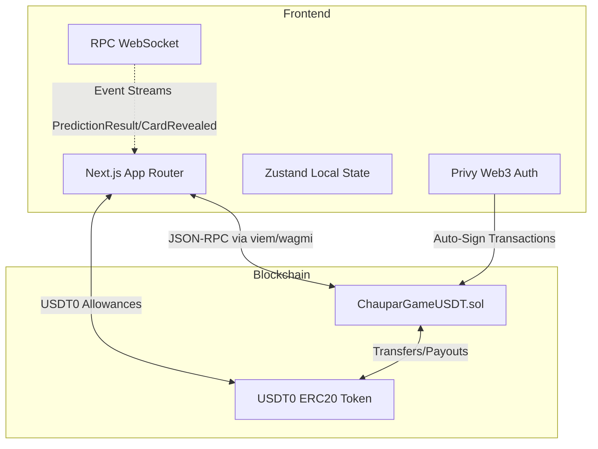

<div align="center">
  
  <h1>चौपड़ (Chaupar)</h1>
  <p><strong>A Provably Fair, On-Chain Prediction Game on Conflux eSpace</strong></p>
  
  [](https://opensource.org/licenses/MIT)
  [](https://confluxnetwork.org/)
  []()
</div>

<br />

> **Global Hackfest 2026 Submission**  
> Chaupar brings the ancient Indian board game aesthetics into the modern Web3 era as a pure on-chain, high-throughput betting game. It merges deep cultural design with rigorous DeFi mechanics, allowing anyone to not just play the game, but *become the house*.

---

## 🌟 Executive Summary

Traditional Web3 casinos suffer from black-box RNG, high gas fees, and centralized house reserves. **Chaupar** solves this by leveraging Conflux eSpace's high-speed and low-fee architecture:
- **100% On-Chain Transparency**: Every bet, random generation, and payout happens natively on the blockchain.
- **Decentralized House Pool (DeFi):** Instead of a central house, Chaupar operates a Liquidity Pool where anyone can deposit `USDT0` to earn yields from the game's mathematical edge.
- **Culturally Localized UI/UX**: Embracing the Indian subculture with Ganjifa art styles, Devanagari numerals, and authentic multi-instrument soundscapes (Tabla, Sitar, etc.).

---

## 🏗️ Architecture & Flow 

The architecture divides into three distinct layers:



### Game Logic & Mathematics
- **96% RTP (Return to Player)**: The smart contract utilizes fixed compound multipliers calculated precisely to yield a 4% house edge over the long term.
- **RNG Mechanism**: Currently utilizes pseudorandomness via `blockhash(block.number - 1)` + hashing of user data. *(Note: Production upgrade path involves integrating a verifiable random oracle like Pyth or Chainlink VRF).*
- **Exposure Protection**: Wagers are locally clamped between 1–10 USDT0, and globally protected by an overall House Pool `exposureLimit`. The max possible win is capped at **1000 USDT0**.

---

## 🏦 The Decentralized House Pool

Chaupar functions as a dual-sided marketplace. It isn't just a game; it's a yield-bearing mechanism.

1. **Liquidity Providers (LPs)** deposit `USDT0` into the House Pool.
2. They are minted **LP Shares** representing their proportional ownership.
3. Every time a player loses a bet, the funds are swept into the House Pool treasury, immediately increasing the base value of all existing LP shares.
4. LPs bear the short-term variance but statistically capture the 4% house edge. They can withdraw entirely at any time (provided funds are not locked in active gameplay escrow).

---

## 🚀 Setup & Installation Guide

Follow these steps to run Chaupar locally against the Conflux eSpace Testnet.

### 1. Prerequisites
- **Node.js** (v18 or higher)
- **Web3 Wallet** (MetaMask, BlockWallet, Rabby)
- **Testnet Tokens**: You will need both testnet CFX (for gas) and testnet USDT0 (for bets).
  👉 *[Conflux eFaucet](https://efaucet.confluxnetwork.org/)*

### 2. Smart Contract Deployment (Optional)
If you wish to deploy your own instance of the game contract:
```bash
git clone https://github.com/YOUR_GITHUB/chaupar-onchain.git
cd chaupar-onchain
npm install

# Compile contracts
npx hardhat compile

# Deploy to testnet
npm run deploy:usdt:testnet
```
*Note down the deployed contract address. The deploy script automatically funds the initial house pool.*

### 3. Frontend Setup
Navigate to the frontend directory and start the app:
```bash
cd frontend
npm install

# Create environment configuration
cp .env.example .env.local
```

Edit your `.env.local` to match your deployed contract (or use ours):
```env
NEXT_PUBLIC_PRIVY_APP_ID="your_privy_id"
NEXT_PUBLIC_CONTRACT_ADDRESS="0xYourContractAddress..."
NEXT_PUBLIC_USDT_ADDRESS="0x4d1beb67e8f0102d5c983c26fdf0b7c6fff37a0c"
```

Start the application:
```bash
npm run dev
```
Navigate to `http://localhost:3000` to begin playing.

---

## 📈 Go-To-Market (GTM) Strategy

Chaupar is designed to penetrate the nascent Conflux gaming sector through a three-pronged approach:

1. **The Liquidity Flywheel**  
   We initially market to DeFi users seeking single-sided staking yields. By offering the House Pool as a financial product, we build deep liquidity. Deep liquidity allows us to raise betting caps, which attracts high-roller players, directly feeding back into the LP yields.
   
2. **Cultural Resonance across APAC**
   By utilizing deep aesthetic ties to Indian Ganjifa and Hindi localizations, we differentiate immediately from sterile, westernized casino templates. This taps into the massive, culturally-prideful APAC gaming demographic.

3. **Infrastructural Upgrades**
   - **Phase 1 (Current)**: eSpace Testnet MVP proving the mathematical edge.
   - **Phase 2**: Launching Mainnet + Verifiable Random Function (VRF) integration.
   - **Phase 3**: Integration of ERC-4337 Account Abstraction. Players will experience 0 gas fees (subsidized by the house pool), bringing the UX perfectly in-line with Web2 standards.

---

## 📄 Licensing & Open Source

This project has been developed openly for the Conflux Global Hackfest. The source code is licensed under **MIT**. Code is provided “as is” without warranty. 
