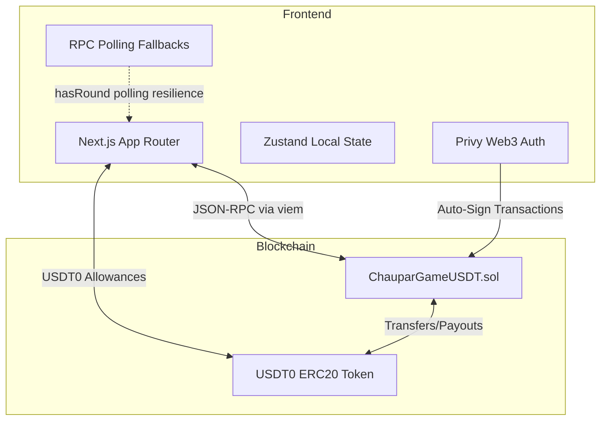

<div align="center">
  
  <h1>Chaupar (चौपड़)</h1>
  <p><strong>A Provably Fair, On-Chain Prediction Game on Conflux eSpace</strong></p>
  
  [](https://opensource.org/licenses/MIT)
  [](https://confluxnetwork.org/)
  []()
</div>

<br />

## Overview

Chaupar is an advanced Web3 prediction game built entirely on Conflux eSpace. Instead of building just another generic "Hi-Lo" clone, we have reinvented the mathematical core into a decentralized **Liquidity Pool House** and wrapped the UI in the rich, ancient heritage of Indian **Ganjifa** aesthetics. Players access a blazing-fast, transparent betting experience with a strict 96% RTP, while DeFi users deposit USDT0 to passively farm the house edge.

## Hackathon

**Global Hackfest 2026** (2026-03-23 – 2026-04-20)

## Team

- **Manisai** (GitHub: [@manisaigaddam](https://github.com/manisaigaddam) | Discord: manisai#5791) - Full Stack / Smart Contracts
- **Manikanta** (GitHub: [@manialex7569](https://github.com/manialex7569) | Discord: manikanta#5791) - UI/UX & Architecture

## Problem Statement

Web3 gaming is saturated with westernized casino templates that rely on off-chain black-box RNG and centralized, privileged house treasuries. This creates three critical industry problems:
1. **The Casino Monopoly**: Liquidity and yields are concentrated at the top.
2. **The Gas Bottleneck**: High-frequency predictive gaming is impossible on L1 Mainnets due to scaling costs.
3. **The Cultural Gap**: The APAC region represents the largest gaming demographic, yet lacks culturally native Web3 products.

## Solution

**Chaupar** specifically avoids these pitfalls by operating as a decentralized, dual-sided marketplace governed entirely by an immutable Solidity construct on Conflux eSpace.
- **In Chaupar, *you* are the house.** By democratizing the House Edge (4%) into an open LP pool, any DeFi user can earn passive yields directly from global player volume.
- **Bulletproof State Recovery**: Drop a WebSocket connection? Close your browser mid-bet? The Chaupar frontend reads `hasRound` states directly from the Conflux chain, seamlessly restoring paused P2E sessions without losing player funds.
- **Authentic Localization**: We bring the ancient Indian game of chance on-chain with authentic Hindi localization, Devanagari numerals, and classical Indian soundscapes to deeply penetrate the APAC market.

## Go-to-Market Plan

Chaupar is designed to penetrate the nascent Conflux gaming sector through a three-pronged approach:

1. **The Liquidity Flywheel**  
   We initially market to DeFi degens seeking single-sided staking yields. Deep liquidity enables higher betting caps, which attracts high-roller gamers, feeding directly back into LP yield maximization.
   
2. **Cultural Moat in APAC**
   By utilizing deep aesthetic ties to Indian board systems (चौपड़) rather than standard playing cards, we create sticky, culturally prideful viral loops unreplicable by western white-label casinos.

3. **Infrastructural Roadmap**
   - **Phase 1 (Current)**: eSpace Testnet MVP proving the mathematical edge & UX.
   - **Phase 2**: Launching Mainnet + Verifiable Random Function (VRF) Oracles.
   - **Phase 3**: Integration of ERC-4337 Account Abstraction. Paymasters will leverage the House Pool yields to implicitly subsidize 100% of player gas fees—pushing onboarding friction to absolute zero.

## Conflux Integration

Chaupar leverages the following Conflux features to ensure blazing-fast execution:

- [ ]  Core Space
- [x]  eSpace (Deployed native Solidity contracts utilizing Conflux's EVM-compatible execution layer for sub-second block times)
- [ ]  Cross-Space Bridge
- [ ]  Gas Sponsorship
- [x]  Built-in Contracts (Interactions with USDT0 ERC20 primitives)
- [x]  Partner Integrations (Privy for frictionless pseudo-custodial Web3 Auth)

## Features

- **Strict 96% RTP Mathematics**: The smart contract calculates risk probabilities dynamically on every single card drawn. It uses fixed compound multipliers to ensure the mathematical payout ratio adheres strictly to a 96% Return-To-Player rate over infinite rounds, generating the 4% edge utilized for LP yields.
- **Dynamic Exposure Limiting**: To protect Liquidity Providers from bankruptcy events, Chaupar dynamically caps maximum bets in real-time based on the total depth of the USDT0 pool. If the pool shrinks, max bets shrink.
- **Decentralized Liquidity Pool**: Open to everyone. A true DeFi implementation of casino mechanics.

## Technology Stack

- Frontend: React, Next.js (App Router), Zustand, Tailwind CSS, Framer Motion
- Backend: Hardhat, Custom TypeScript Oracles (planned)
- Blockchain: Conflux eSpace
- Smart Contracts: Solidity (Standard ERC20 & Blockhash RNG models)
- Web3 Integrations: Privy Web3 Auth, viem/wagmi hooks

## Setup Instructions

### Prerequisites

- Node.js v18+
- Git
- Conflux wallet (Fluent, MetaMask) configured to Conflux eSpace Testnet
- Testnet CFX and USDT0 (Available from Conflux Faucets)

### Installation

1. Clone the repository
    ```bash
    git clone https://github.com/manisaigaddam/chaupar.git
    cd chaupar
    ```

2. Install dependencies
    ```bash
    cd frontend
    npm install
    ```

3. Configure environment
    ```bash
    cp .env.example .env.local
    ```
    Edit `frontend/.env.local` with your configuration:
    ```env
    NEXT_PUBLIC_PRIVY_APP_ID="your_privy_id"
    NEXT_PUBLIC_CONTRACT_ADDRESS="0x2fB5C50e4B6F9F27b43200cB714b88A7F38882Ab"
    NEXT_PUBLIC_USDT_ADDRESS="0x4d1beb67e8f0102d5c983c26fdf0b7c6fff37a0c"
    ```

4. Run the application
    ```bash
    npm run dev
    ```

### Testing

*(Smart Contract Tests)*
```bash
npx hardhat test
```

## Usage

1. **Connect**: Click 'Connect Wallet' and authenticate via Privy.
2. **Deposit LP (Optional)**: Head to the House Pool tab and deposit USDT0 to become the house.
3. **Play**: Go to the Game tab. Ensure you have Testnet CFX (for gas) and USDT0 (for your bet). Select your wager amount and press play. Predict Higher or Lower based on the initial dealing!
4. **Resilience**: If your browser crashes during a round, simply reopen the browser—your session auto-recovers natively via blockchain state polling.

## Demo

- **Live Demo**: https://chaupar.vercel.app/
- **Demo Video**: https://youtu.be/WBGArlqnRRk
- **Intro Video**: https://youtu.be/Ll2LyZ-SDQE
- **Screenshots**: See `/demo/screenshots/` folder

## Architecture

The architecture divides into three highly scalable layers:



## Smart Contracts

The game utilizes fully verified EVM-compatible contracts on Conflux:

- ChauparGameUSDT: `0x2fB5C50e4B6F9F27b43200cB714b88A7F38882Ab` (Conflux eSpace Testnet)
- Base Token (USDT0): `0x4d1beb67e8f0102d5c983c26fdf0b7c6fff37a0c`

## Future Improvements

- Implementation of True Verifiable Random Function (VRF).
- Expanding ERC-4337 Account Abstraction paymasters utilizing the Liquidity Pool yield to fully sponsor player gas.
- Launching Mainnet multi-chain variants targeting EVM networks heavily focused in APAC gaming markets.

## License

This project is licensed under the MIT License - see the [LICENSE](LICENSE) file for details.

## Acknowledgments

- **Conflux Network** & Global Hackfest 2026 Organizers
- **Privy** for seamless and secure Web3 Onboarding libraries
